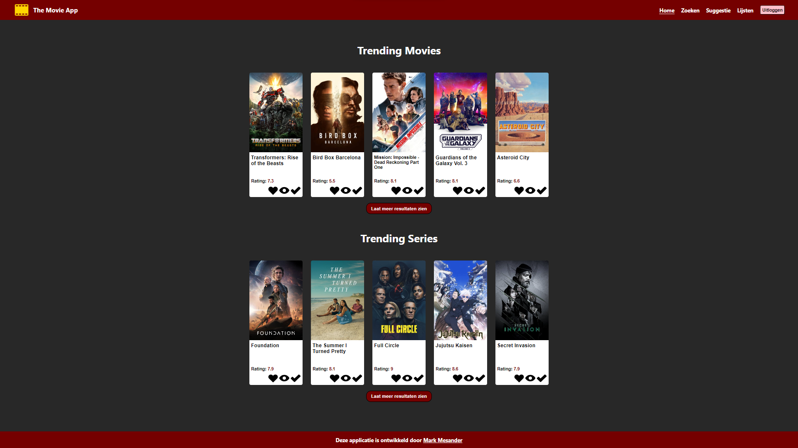

# Installatiehandleiding The Movie App

## Inleiding

Van harte welkom bij The Movie App. Deze applicatie is ontwikkeld om jou te helpen met het inventariseren van jouw film 
of serie keuze. De applicatie laat je trending films en series zien, je kan zoeken naar specifieke titels, of je kan 
een gefilterde zoekopdracht doen naar films, series aan de hand van rating, populariteit en genres. Daarnaast kan je de 
applicatie een suggestie laten doen als je zelf even geen inspiratie hebt. Tot slot kan je films en series toevoegen in 
je favorieten lijst, je watchlist of je al gezien lijst. Onwijs veel plezier met het ontdekken van The Movie App!

## Inhoudsopgave

- Benodigdheden
- Installatie Stappenplan
- Registreren en Inloggen
- De app gebruiken

## Benodigdheden

- **Google Chrome**
  - Het is ten zeerste aan te raden om Chrome te installeren. Deze applicatie is ontwikkeld met Google Chrome als browser. 
  - Klik [hier](https://www.google.com/intl/nl/chrome/) om de laatste versie van Chrome te downloaden.
  

- **IDE (naar keuze)**
  - Je hebt een IDE nodig om de applicatie te kunnen draaien.
  - Webstorm is optimaal voor het runnen van de applicatie.
  - Klik [hier](https://www.jetbrains.com/webstorm/download/?source=google&medium=cpc&campaign=9641686272&term=webstorm&content=523833970973&gad=1&gclid=CjwKCAjw5MOlBhBTEiwAAJ8e1kzh-6XpOJo2tqvGM1ou0kabBmp27O0dyb19BKdaoOgjO5JxQiV7TBoCogAQAvD_BwE#section=windows) om de laatste versie van Webstorm te downloaden.
  - **Let op:** Webstorm is geen gratis IDE. Je kan een tijdelijke proefversie van 30 dagen downloaden.

- **Node JS**
  - Je hebt Node.js nodig om commando's in de terminal te kunnen uitvoeren.
  - Klik [hier](https://nodejs.org/en/download/current) om de laatste versie van node.js te downloaden.

- **GIT**
  - Je hebt GIT nodig om de applicatie te kunnen clonen
  - Klik [hier](https://git-scm.com/downloads) om de laatste versie van GIT te downloaden.
  - **Let op:** niet te verwarren met GitHub. Zolang je geen developer bent, heb je dat niet nodig!

- **API Key**
  - Indien je een docent van Novi bent, dan zit de API key in de projectmap in het text document API_KEY
  - Heb je geen bevoegdheid om mij minimaal een 8 te geven? Dan kan je de onderstaande stappen volgen:
    - Klik [hier](https://www.themoviedb.org/signup) om een account aan te maken bij The Movie Database;
    - Zodra je bent ingelogd ga je naar settings en daar klik je op API;
    - Volg de stappen op de website om een API key aan te maken.

## Installatie Stappenplan

1. Installeer google Chrome;

2. Installeer Webstorm of jouw IDE naar keuze;
   - Optioneel: Webstorm instellen. Indien je (vaker) gebruik wilt maken van Webstorm, zijn deze twee plugins top:
   - Monokai Pro Theme;
   - Rainbow Brackets;
   - Om deze plugins te installeren ga je naar File => Settings => Plugins;
   - Typ in de zoekbalk de genoemde plugins en herstart je IDE.
   - Gelukt? Top! Dan ziet je IDE er net zo vrolijk uit als tijdens de ontwikkeling van deze app!

3. Installeer Node.js:
   - Wanneer je Node.js hebt geïnstalleerd is het tijd om te testen of Node.js correct is geïnstalleerd;
   - Als eerste is het raadzaam om eerst je IDE opnieuw op te starten;
   - Vervolgens open je de terminal en typ je het volgende commando: `node-v` en druk daarna op enter;
   - Als Node.js aanwezig is zul je een versienummer te zien krijgen, zoals bijv: `v20.4.0`
   - Vervolgens moet gecheckt worden of NPM correct mee geïnstalleerd is:
   - Dit doe je door het volgende command in de terminal te typen: `npm -v` en druk daarna op enter;
   - Als npm correct geïnstalleerd is dan zal je opnieuw een versienummer te zien krijgen, zoals bijv: `9.7.2`
   - Indien je de foutmelding `npm: command not found` krijgt, installeer Node.js dan opnieuw.

4. Installeer Git:
   - Wanneer je Git hebt geïnstalleerd, gaan we testen of Git correct is geïnstalleerd:
   - Als eerste is het raadzaam om eerst je IDE opnieuw op te starten;
   - Vervolgens open je de terminal en typ je het volgende commando: `git help` en druk daarna op enter;
   - Wanneer je een opsomming krijgt van Git-commando's, dan is de installatie geslaagd;
   - Indien je een rode foutmelding krijgt, probeer dan eerst je computer opnieuw op te starten;
   - Krijg je hierna nog steeds een foutmelding te zien, probeer Git dan opnieuw te installeren.

    
    
5. De applicatie binnenhalen:
   - Ga als eerste naar [deze](https://github.com/mmesander/eindopdracht-frontend-the-movie-app.git) directory;
   - Klik op de groene button met `<> Code`;
   - Zorg dat het 'menu' op **HTTPS** staat en kopieer de link die daaronder staat;
   - Optioneel: Als je een SSH key hebt dan kan je de SSH link gebruiken;
   - Klik vervolgens in je IDE op File => New => Project from version control...;
   - Plak de link die je op github hebt gekopieerd in het vak met URL;
   - Als het goed is heb je nu de applicatie geopend op je IDE.

6. Dependencies installeren:
   - Je hebt NPM natuurlijk niet voor niets geïnstalleerd met Node.js, het is tijd om NPM te gaan gebruiken:
   - Als eerste gaan we de dependencies van de applicatie installeren;
   - **Let op:** Dit kan even duren als je een langzame computer hebt;
   - Typ het volgende commando in je terminal en druk daarna op enter:
    ### `npm install`

7. De Api Key in het project zetten:
   - Als het goed is heb je een API Key (gekregen als docent, of zelf [aangevraagd](https://www.themoviedb.org/signup));
   - Dan gaan we deze nu in het project zetten;
   - Als eerste Klik je in je IDE links op de project map;
   - Vervolgens zie je het Project met bovenin een map > eindopdracht-frontend-the-movie-app;
   - Klik op het > zodat deze map uitklapt, dit is overigens de hoofdmap;
   - Als het goed is zie je de volgende mappen en bestanden:
     - node_modules
     - public
     - src
     - .env.dist
     - .gitignore
     - package.json
     - package-lock.json
     - README.md
   - Dan is het nu belangrijk dat je de volgende stappen **exact** opvolgt:
   - Klik met de rechtermuisknop op de hoofdmap (eindopdracht-frontend-the-movie-app);
   - Selecteer New → File, en noem die file .env;
   - Als het goed is zie je de volgende mappen en bestanden:
       - node_modules
       - public
       - src
       - .env
       - .env.dist
       - .gitignore
       - package.json
       - package-lock.json
       - README.md
   - Open vervolgens het .env bestand en plak hier de **Volledige API Key** in;
   - Dus inclusief het 'REACT_APP_API_KEY' gedeelte;
   - Als laatste gaan moet er eenmalig een build gemaakt worden;
   - Dit doe je door het volgende commando in de terminal te typen en op enter te drukken:
   ### `npm run build`

8. De applicatie starten
   - Als je alle stappen netjes hebt doorlopen, is het nu tijd om de applicatie op te starten;
   - Dat doe je door het onderstaande command in de terminal te typen en op enter te drukken;
    ### `npm start`
   
## Registreren en Inloggen

**We zijn er bijna! Voordat je met de app aan de slag kan moet je eerst registreren en inloggen**
- Klik in de applicatie als eerste op de link *'registreer je nu'*.
- Voer een email adres in:
  - Zorg dat dit een geldig email adres is wat niet al in gebruik is in de app;
- Voer een gebruikersnaam in:
  - Gebruik minimaal 6 tekens;
  - Gebruik alleen letters, cijfers en underscores (voor de leken onder ons: _ );
- Voer een wachtwoord in:
  - Gebruik minimaal 6 tekens
  - Gebruik minimaal een hoofdletter, een kleine letter, een getal en een speciaal teken;
- Voer nogmaals hetzelfde wachtwoord in;
- **Pas zodra aan al deze genoemde voorwaarden is voldaan, is de knop registreren pas klikbaar**
- Zodra je op registreren hebt geklikt, krijg je een melding als het gelukt is;
- Je wordt dan vanzelf na 3 seconden naar de login pagina geleid;
- Voer hier je **gebruikersnaam** (dus niet je email) en je **wachtwoord** in en klik op inloggen!

## De app gebruiken

**Het leukste is natuurlijk zelf uitvinden wat je allemaal met de app kan! Wil je toch graag weten wat je kan, dan kan 
je hier een kijkje nemen voor de functionaliteiten:**
- De Homepage (Home):
  - Op de homepage zie je de top 5 trending films en trending series;
  - Elke film of serie is klikbaar en leidt je naar een pagina met film-details of serie-details.
  - Indien je meer trending films of series wilt zien kan je klikken op *'laat meer resultaten zien'*;
  - Zodra je op meer trending films klikt komen bovenaan de pagina knoppen met volgende en vorige te staan;
  Hiermee kan je naar de volgende en vorige pagina met resultaten navigeren;
  - Indien je minder trending films of series wilt zien, klik dan op *'laat minder resultaten zien'*;
  - Slechts 1 menu kan uitgeklapt zijn, of de series, of de films.

- De Zoekpagina (Zoeken):
  - Op de zoekpagina kan je kiezen tussen een specifieke zoekopdracht of een filter zoekopdracht;
  - Voor een specifieke zoekopdracht kan je in de balk onder *'Zoeken'* een zoekopdracht typen;
  - Vervolgens kan je op *'Zoek'* klikken of op enter drukken;
  - Naast een specifieke zoekopdracht kan je ook een gefilterde zoekopdracht uitvoeren;
  - Onder *'Filters'* kan je als eerste kiezen tussen films en series;
  - Daarna kan je een minimale rating invoeren en een maximale rating;
  - **Let op:** de maximale rating kan niet kleiner zijn dan de minimale rating;
  - Vervolgens kan je diverse genres selecteren;
  - Tot slot druk je onderin op de knop *'Zoeken'* om de gefilterde resultaten te verkrijgen;
  - Zodra je de resultaten binnen hebt, is het mogelijk om deze te sorteren op de volgende opties:
    - Populariteit - Aflopend
    - Populariteit - Oplopend
    - Beoordeling - Aflopend
    - Beoordeling - Oplopend
    - Verschijningsdatum - Aflopend
    - Verschijningsdatum - Oplopend

- De Suggestiepagina (Suggestie):
  - Op de suggestiepagina kan je aangeven waar je zin in hebt:
    - Van de bank te rollen van het lachen;
    - Op het puntje van je stoel te zitten;
    - Je af en toe te moeten verstoppen achter een dekentje;
    - Om in een andere wereld te belanden;
    - Om met een doos tissues op de bank te zitten;
  - Wanneer je een keuze hebt gemaakt, gaat de applicatie een aantal suggesties doen aan de hand van de door jou ingevulde stemming.

- De Lijstenpagina (Lijsten):
  - Wanneer je voor het eerst op de pagina komt, dan zal je zien dat al jouw lijsten nog leeg zijn;
  - Weet je nog dat elke film en serie klikbaar is?
  - Wanneer je op een film of serie klikt, dan kom je op de film-details of serie-details pagina;
  - Op deze pagina zie je boven de rating drie icoontjes staan;
  - Deze icoontjes staan alle drie voor een lijst, wanneer je met je muis over het icoontje gaat, zie je welk icoontje
  voor welke lijst staat:
    - De favorieten lijst - het hartje
    - De watchlist - het oog
    - De al gezien lijst - het vinkje
  - Wanneer je op een specifiek icoontje klikt, wordt die specifieke film toegevoegd aan de lijst.

### Nawoord

**De versie van de applicatie is 1.0. De applicatie is in ontwikkeling en zal doorontwikkeld blijven worden. 
Mis je specifieke functionaliteiten of zitten er fouten in de applicatie, neem dan [contact](https://www.linkedin.com/in/mark-mesander/) op!**